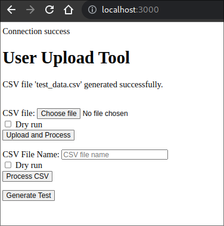

# User Upload Script

The user_upload.php is a CLI tools that accepts a CSV file as input (see command line directives below) and processes the CSV file. The parsed file data is to be inserted into a MySQL database.
Beside all the basic requirements, the script also include these features:

- [x] Can be run independently from host env with Docker
- [x] Use directly with [docker run](#usage) 
- [x] Security implementation (SQL Injection, DOS)
- [x] Test script to generate a CSV file for test
- [x] Frontend web for easy testing

## Table of Contents

- [Catalyst Challenge](#catalyst_challenge)
  - [Table of Contents](#table-of-contents)
  - [Feature Completion Status](#features-completion-status)
  - [Installation](#installation)
    - [Database Credentials](#database-credentials)
  - [Usage](#usage)
    - [Asciicast Video](#video)
  - [How to use the test script](#how-to-use-the-test-script)
  - [How to use web](#how-to-use-web)

## Feature Completion Status


Below is the list of features and their completion status. 

- [x] Create a Docker environment with Dockerfile the united with the Assumptions in the task (Ubuntu 22.04, Mysql)
- [x] Perform basic requirements
- [x] Apply Security measurement: DOS (import from CSV)
- [x] Apply Security measurement: SQL Injection (import from CSV)
- [ ] Apply Security measurement: OS Injection
- [x] Generate test script 
- [x] A frontend web for easy test
- [ ] Fix the database config, it is better to create a DBConfig class or create a .env
- [ ] Implement based on OOP, like create a class User (though as I understand the task were to create a script)
- [ ] Expose the docker so that it can insert into other Mysql database outside

## Installation
There are 2 options:

1. Install the assumptions environment: Ubuntu 22.04, php8.1, mysql

2. Build the docker:
   ```bash
   #Build the docker
   docker build -t catalyst .
   ```
### Database Credentials

- Set default if not provided:

```env
DB_HOST=localhost 
DB_NAME=users
DB_USER=phulelouch 
DB_PASSWORD=phulelouch
```


## Usage

### VIDEO:
*Please refer to this asciicast for easy installation and use*

[](https://asciinema.org/a/ERHWJtk7uQeMncFOaNID5Q0ah)

1. Run with the assumptions environment

2. Access the docker terminal and run the script:
  - Access /bin/bash:
  ```bash
   #Access the terminal inside docker
   docker run -it --rm catalyst /bin/bash
   ```
  - Run the script:
   ```bash
    php user_upload.php [options]  
   ```

3. Run the script directly

*Note: This will not preserve the database since the database is in the docker as php script (all inside the Ubuntu docker).*
*This is the assumptions I made: in case the database is outside of docker we can expose the docker and the script will still run as an independence tools.*

  - Parse the argument into it directly:
  ```bash
    #Run directly like ... --help
    docker run -it --rm catalyst --file test_data.csv
  ```
  - Tips:
  ```bash
    #Run alias to create a alias so that you don't have to type too many times
    alias catalyst='docker run -it --rm catalyst'
  ```


## How to use the test script
*In addition I create a script to create CSV file for testing. This script will add invalid special characters at random point to test the filters ability*

 ```bash
    #File output at the location of running
    php test/test.php
```
The test csv name is: test_data.csv after that, use as normal and use the test_data.csv instead of users.csv

## How to use web

The frontend is a simple features use php/html for testing the script faster

 ```bash
    #expose port 3000
    docker run -p 3000:3000 -it --rm catalyst web
```
Open your browser at http://localhost:3000/

<p align="center">
  
</p>

## AI usage

AI was use to help with:
- Unknow syntax and functions like: ucfirst, getopt
- Help with regex syntax
- Help with creating test script


